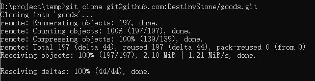
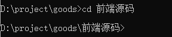
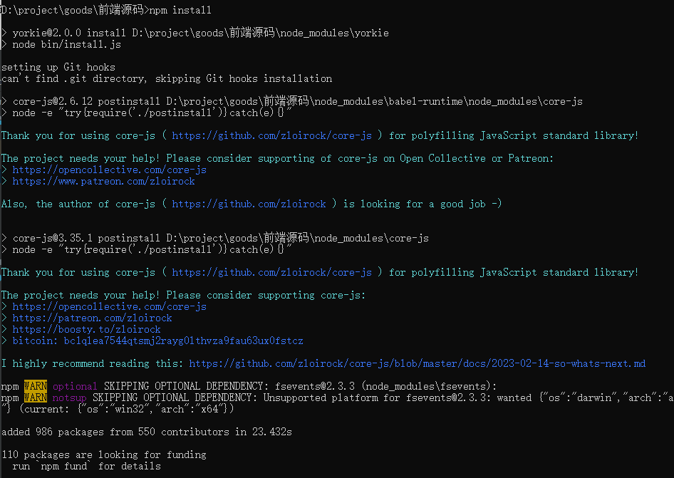
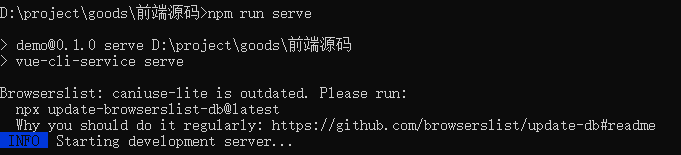
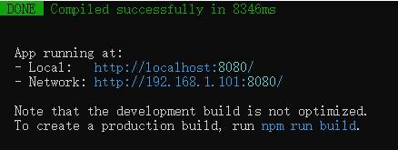
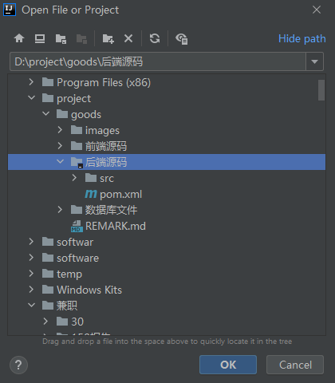
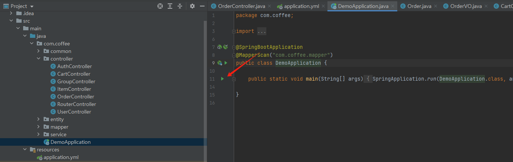
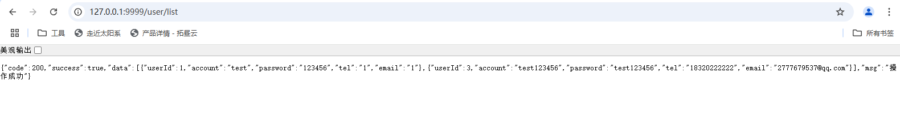

# 系统环境要求
| 软件                   | 版本                   |
| ---------------------- | -------------------- |
| jdk                    | 1.8                  |
| node                   | v12.16.3             |
| mysql                  | 8.0                  |
| idea                   | 2024.2.3              |

# 项目运行、测试和部署

## 前端项目
1. git clone 将项目部署至本地
   ```shell
   git clone git@github.com:DestinyStone/goods.git
   ```
   
2. 项目根目录下打开cmd, 使用 cd 进入前端目录
   ```shell
   cd 前端源码
   ```
   
3. npm install 安装项目依赖
      ```shell
   npm install
   ```
   
4. npm run server 运行项目
   ```shell
   npm run server
   ```
   
   
5. 访问 http://127.0.0.1:8080 测试项目是否正常
   
## 后端项目
1. git clone 将项目部署至本地
   ```shell
   git clone git@github.com:DestinyStone/goods.git
   ```
   
2. 使用idea打开项目，等待maven依赖安装完毕
   
   
3. 启动DemoApplication类运行项目
   
   
   
4. 访问 http://127.0.0.1:9999/user/list 测试项目是否正常
   
   

